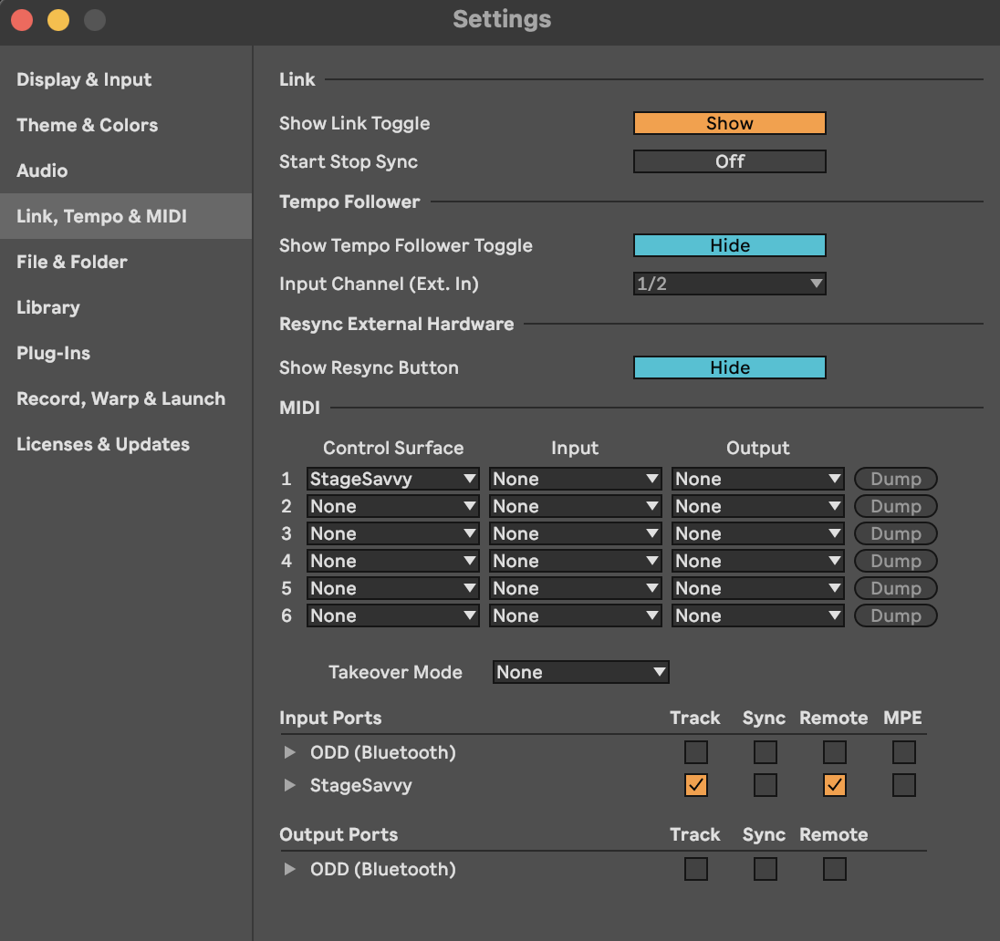

# Stage Savvy

Stage Savvy is MIDI translator that is capable of translating any MIDI message to any in Ableton. You don't need to run separate, it installs as Ableton MIDI Remote script inside Ableton.

## Support

Mac OS

Ableton 12.1

## Installation

1)

Place StageSavvy dir inside /Users/your-user/Music/Ableton/User Library/Remote Scripts dir

2)

Select ControlSurface: StageSavvy

Input: your-midi-device that you want to translate messages from

Input Ports:

* check Track and Remote on StageSavvy

* check only Track on your-midi-device



## Configuration

You can configure MIDI translations in Settings.txt file

```
[mapping-1]
"CC.1.1.X" = "CC.16.100.X"
"NOTE.1.1.X" = "CC.16.101.X"
"CC.1.2.X" = "NOTE.1.2.X.70ms"
"CC.1.3.100" = "CC.1.10.50"
```

Explanations:

If I receive CC1 message on channel 1 from your-midi-device, I translate it to CC100 message on channel 16, where X is modifier (eg 1 is 1, 50 is 50, etc).

If I receive NoteOn1 message on channel 1 from your-midi-device, I translate it to CC101 message on channel 16, where X is modifier (eg velocity 1 is value 1, velocity 10 is value 10, etc).

If I receive CC2 message on channel 1 from your-midi-device, I translate it to NoteOn2 (second note in lowest octave) message on channel 1, I keep playing note for 70ms and send NoteOff2, where X is modifier (eg velocity 1 is value 1, velocity 30 is value 30, etc).

If I receive CC3 message at value 100 on channel 1 from your-midi-device, I translate it to CC10 on channel 1 with value 50.

## Troubleshooting

Check log file /Users/your-user/Library/Preferences/Ableton/Live-version-here/Log.txt

You can open Github issue by sending your log

